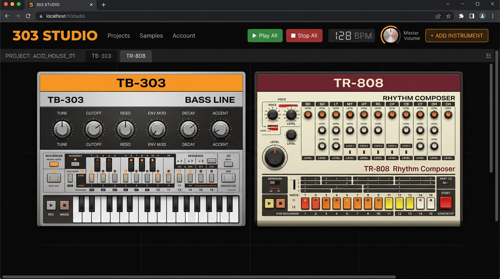
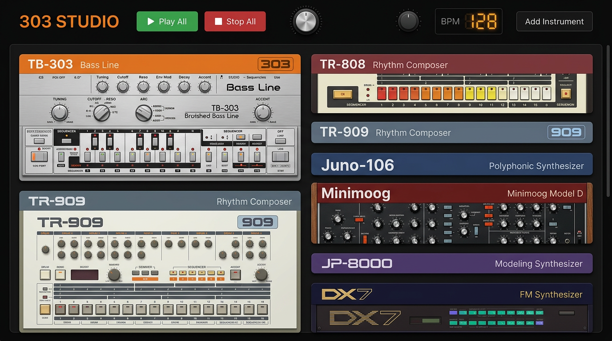
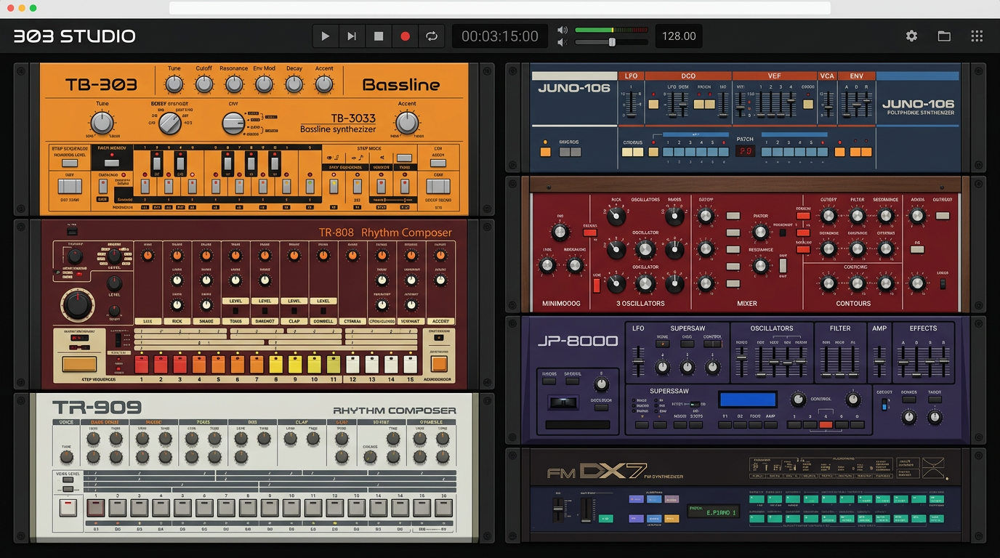
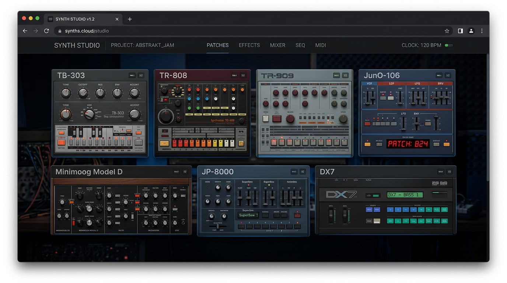
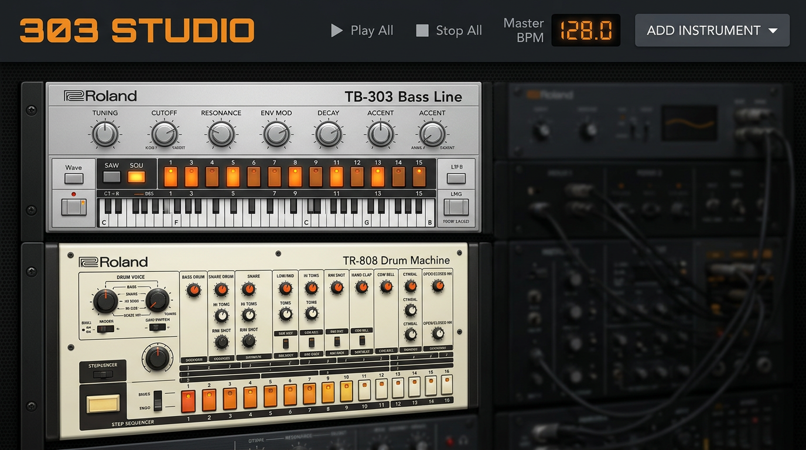
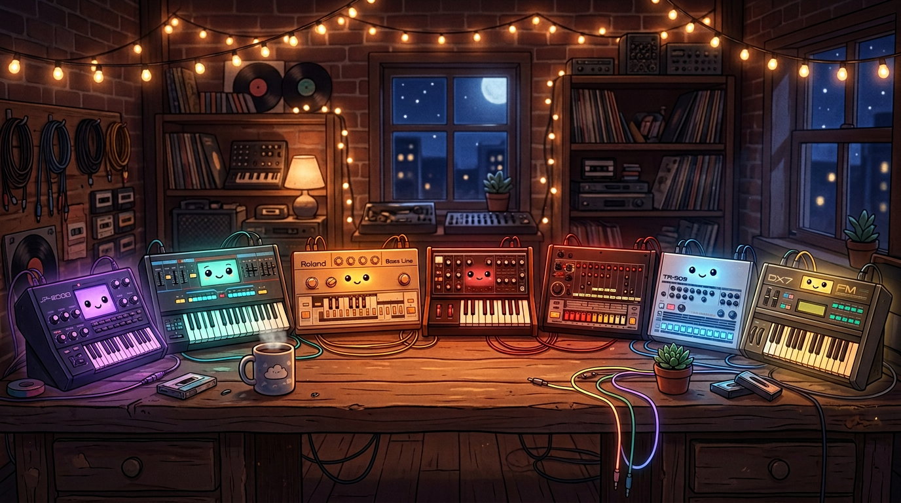
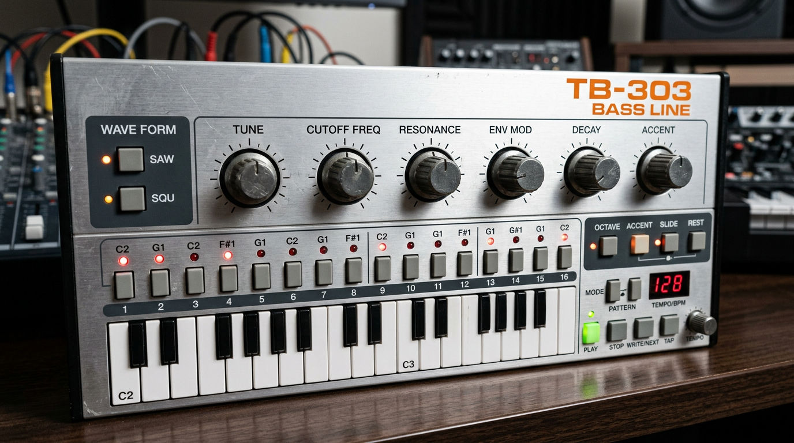

# 303 Studio

A multi-instrument web studio with classic synthesizer and drum machine emulations. Built with vanilla JavaScript and the Web Audio API — no build tools, no bundler. Runs directly in the browser.

### Studio hero

<p align="center">
  
</p>

### UI mockup variants

Realistic dark-theme interface shots in the same spirit as the main rack image (not illustrated / not “cute”).

<p align="center">
  <br>
  <sub>Full rack — stacked instruments</sub>
</p>

<p align="center">
  <br>
  <sub>Two-column layout</sub>
</p>

<p align="center">
  <br>
  <sub>Wide row grid</sub>
</p>

<p align="center">
  <br>
  <sub>Header + top instruments focus</sub>
</p>


<p align="center">
  <br>
  <sub>Cozy desk — lofi night studio vibes</sub>
</p>

## Features

### Synthesizers
- **TB-303 Bass Line** — 16-step sequencer, saw/square waveforms, accent & slide, per-step knob automation
- **Roland Juno-106** — Pad synth with sub osc, chorus, and 16-step sequencer
- **Moog Minimoog** — Classic monosynth lead with oscillators and filter
- **Roland JP-8000** — Supersaw pads with chord mode and 16-step sequencer
- **Yamaha DX7** — FM synthesis with algorithm selector and 16-step sequencer

### Drum machines
- **TR-808 Rhythm Composer** — 7 drum voices with independent patterns, per-voice level and tune
- **TR-909 Drum Machine** — Expanded drum sequencer with multiple voices

### Studio
- **Multi-instrument rack** — Add any combination of instruments, all synced to a master clock
- **Zero dependencies** — Pure HTML, CSS, and JS; works from `file://` or any static host
- **Export & import** — Save patterns as JSON

<p align="center">
  
</p>

## Quick Start

1. Clone the repo:
   ```bash
   git clone https://github.com/sublime303/303studio.git
   cd 303studio
   ```

2. Open in a browser:
   - **Studio** (multi-instrument): open `studio.html`
   - **Standalone TB-303**: open `index.html`

No server required. For best results, use a modern browser (Chrome, Firefox, Safari, Edge). User interaction may be required to start the audio context.

## Project Structure

```
303studio/
├── studio.html          # Multi-instrument studio
├── index.html           # Standalone TB-303 emulator
├── css/
│   ├── studio.css       # Rack, header, shared styles
│   ├── tb303.css        # TB-303
│   ├── tr808.css        # TR-808
│   ├── tr909.css        # TR-909
│   ├── juno106.css      # Juno-106
│   ├── minimoog.css     # Minimoog
│   ├── jp8000.css       # JP-8000
│   └── dx7.css          # DX7
├── js/core/             # Bus, Knob, Studio bootstrap
└── js/instruments/      # tb303, tr808, tr909, juno106, minimoog, jp8000, dx7
```

For architecture details, plugin interface, and how to add new instruments, see [ARCHITECTURE.md](ARCHITECTURE.md).

## License

MIT
